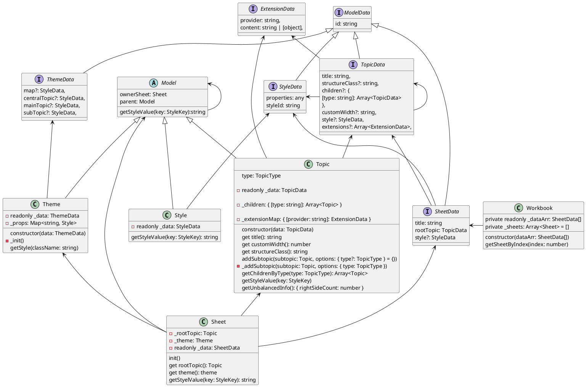

@[TOC]

TODO: 待整理


**usage**

```js
import JSZip from "jszip";
import { loadFromXMind, SnowbrushRenderer } from "xmind-viewer";

new JSZip().loadAsync(zipFile).then((zip) => {
  loadFromXMind(zip)
    .then((data) => {
      const renderer = new SnowbrushRenderer(data.sheets);
      return renderer.render({ sheetIndex: 0 });
    })
    .then((svg) => {
      // document.body.appendChild(svg)
    });
});
```

**tree**

```
.
├── common
├── model
├── structure
├── utils
├── view
├── viewController
├── index.ts
├── snowbrushRenderer.ts
└── xmindLoader.ts
```

类

**SnowbrushRenderer**

```plantuml
@startuml
interface RenderOptions{
sheetIndex: number
}
' skinparam handwritten true
class SnowbrushRenderer{ - \_data:SheetData[] // 数据 - \_sheetViewController: SheetViewController
constructor(data:SheetData):void
' ---------- + render(options: RenderOptions): Canvas + get svg():Svg + get bounds():void + transform(x:number,y:number):{x:number,y:number}
}
' note right of SnowbrushRenderer
' xxxx
' end note

    RenderOptions <|.. SnowbrushRenderer

    SnowbrushRenderer -> Workbook
    SnowbrushRenderer -> SheetViewController


    abstract class ViewController {

        - readonly _parent: ViewController

        constructor(parent: ViewController)

        abstract get type(): ViewControllerType
        abstract get view(): View
        abstract get model(): Model
        get parent(): ViewController
    }

    class SheetViewController extends ViewController{
        - readonly _sheet: Sheet
        - readonly _view: SheetView

        - _centralBranchViewController: BranchViewController
        - _multiLineColors: string
        - _bgColor: string

        + init()
        - _initStyle()
        get type()
        get view():SheetView
        get model(): Sheet
        get multiLineColors()
        hasMultiLineColors()
        ...
    }
    SheetView <- SheetViewController
    BranchViewController <- SheetViewController


    abstract class View {
        abstract readonly type: ViewType

        - _size: Size
        sizeDirty: boolean
        - _prefSize: Size

        abstract get content(): Element
        set size(size: Size)
        get size()
        set preferredSize(preferredSize: Size)
        get preferredSize(): Size
        appendChild(view: View)
    }
    class SheetView extends View{

    }

@enduml
```

**model**关系



## 是什么

xmind-viewer 是一个废弃的库, 用与查看 xmind 的文件，但是内部的代码很有学习的价值

## 运行一下

这个项目目前是运行不了的，需要魔改一下, 直接我直接用 umi 保裹了一下

```shell
git clone https://github.com/aizigao/xmind-viewer
cd xmind-viewer && npm i
npm start
```

## 功能分析

- 读取 xmind 文件 jszip 处理
- 了解 xmind 文件结构
- 渲染 xmind
- 渲染用 svg svg.js
- 这个项目只有查看功能没有编辑功能

## TODO

- [x] svg.js 文档走一遍
- [ ] 当前的渲染结构的 svg 分组结构分析一番

## 杂点

- 文本节点现在也是用 svg 渲染的(这个应该是不利于扩展)
  

- clipPath 一般是蒙层，路径尝试用 illustrator 复制读取


```html
<svg>
  <path
    d="M -139.353515625 -39L 139.353515625 -39Q 147.353515625 -39  147.353515625 -31L 147.353515625 31Q 147.353515625 39  139.353515625 39L -139.353515625 39Q -147.353515625 39  -147.353515625 31L -147.353515625 -31Q -147.353515625 -39  -139.353515625 -39 
  M -10000 -10000
  L 10000 -10000
  L 10000 10000
  L -10000 10000
"
    fill="black"
    transform="translate(0 0)"
    clip-rule="evenodd"
  ></path>
</svg>
```

复制生成 test.svg, illustrator 打开


test2.svg

```html
<svg>
  <path
    d="M -139.353515625 -39L 139.353515625 -39Q 147.353515625 -39  147.353515625 -31L 147.353515625 31Q 147.353515625 39  139.353515625 39L -139.353515625 39Q -147.353515625 39  -147.353515625 31L -147.353515625 -31Q -147.353515625 -39  -139.353515625 -39 
  M -10000 -10000
  L 10000 -10000
  L 10000 10000
  L -10000 10000
"
    fill="black"
    transform="translate(0 0)"
    clip-rule="evenodd"
  ></path>
</svg>
```

## svg group 分析

- [sheet] 最外层 外面有个 transform
  - [connection-container] -> [connection] 存放链接线 
  - [branch-container] -> [branch] 分支
    

**connection**

- 都是一个 path clip-path 现在看仅是一个框

**branch**

结构


再子一级也是打平的


## 源码学习

原来的代码都在我的仓库的 src/core 内

### 代码目录

看文件文件的结构可以看到是一个很标准的 mvc 结构，个人技术栈历史是 简单 jquery -> angular1 -> react | vue, 没有相关的经验

```
.
├── common
│   └── constants
│       ├── extensions.ts
│       ├── layoutSettings.ts
│       ├── models.ts
│       ├── structures.ts
│       ├── styles.ts
│       ├── viewControllers.ts
│       └── views.ts
├── index.ts
├── model
│   ├── model.ts
│   ├── sheet.ts
│   ├── style.ts
│   ├── theme.ts
│   ├── topic.ts
│   └── workbook.ts
├── snowbrushRenderer.ts
├── structure
│   ├── abstractStructure.ts
│   ├── baseMap.ts
│   ├── fishboneLeftHeaded.ts
│   ├── fishboneNENormal.ts
│   ├── fishboneNWNormal.ts
│   ├── fishboneRightHeaded.ts
│   ├── fishboneSENormal.ts
│   ├── fishboneSWNormal.ts
│   ├── helper
│   │   ├── allStructures.ts
│   │   └── structureUtils.ts
│   ├── leftAndRight.ts
│   ├── logicLeft.ts
│   ├── logicRight.ts
│   ├── mapClockWise.ts
│   ├── mapUnbalanced.ts
│   ├── orgChart.ts
│   ├── orgChartDown.ts
│   ├── orgChartUp.ts
│   ├── timelineHorizontal.ts
│   ├── timelineHorizontalDown.ts
│   ├── timelineHorizontalUp.ts
│   ├── timelineVertical.ts
│   ├── treeLeft.ts
│   ├── treeLeftAndRight.ts
│   └── treeRight.ts
├── utils
│   ├── area.ts
│   ├── bounds.ts
│   ├── branchUtils.ts
│   ├── fontInfo.ts
│   ├── layoutUtil.ts
│   ├── position.ts
│   ├── size.ts
│   ├── stringNodes.ts
│   └── styleManager
│       ├── defaultStyles.ts
│       ├── index.ts
│       ├── layeredStyleManager
│       │   ├── layeredStyleManager.ts
│       │   └── styleDescriptor.ts
│       ├── selector
│       │   ├── mindMapStyleSelector.ts
│       │   ├── sheetStyleSelector.ts
│       │   └── topicStyleSelector.ts
│       └── styleSelectorFactory.ts
├── view
│   ├── branchView.ts
│   ├── connectionView.ts
│   ├── layoutEngine
│   │   ├── layouts
│   │   │   ├── cell.ts
│   │   │   ├── gridData.ts
│   │   │   ├── gridLayout.ts
│   │   │   ├── layout.ts
│   │   │   └── layoutData.ts
│   │   ├── titleLayoutWorker.ts
│   │   └── topicLayoutWorker.ts
│   ├── lineRender
│   │   └── topicLineStyle.ts
│   ├── renderEngine
│   │   └── topicShape
│   │       ├── brushes.ts
│   │       ├── brushesHelper.ts
│   │       ├── circleTopicShape.ts
│   │       ├── diamondTopicShape.ts
│   │       ├── doubleUnderlineTopicShape.ts
│   │       ├── ellipseRectTopicShape.ts
│   │       ├── ellipseTopicShape.ts
│   │       ├── ellipticRectangleTopicShape.ts
│   │       ├── fishHeadToLeftTopicShape.ts
│   │       ├── fishHeadToRightTopicShape.ts
│   │       ├── fishboneUnderlineTopicShape.ts
│   │       ├── hexagonTopicShape.ts
│   │       ├── index.ts
│   │       ├── parallelogramTopicShape.ts
│   │       ├── rectTopicShape.ts
│   │       ├── roundedHexagonTopicShape.ts
│   │       ├── roundedRectTopicShape.ts
│   │       ├── singleBreakAngleTopicShape.ts
│   │       ├── stackTopicShape.ts
│   │       ├── topicShape.ts
│   │       ├── topicShapeUtils.ts
│   │       └── underlineTopicShape.ts
│   ├── sheetView.ts
│   ├── textView.ts
│   ├── topicTitleView.ts
│   ├── topicView.ts
│   └── view.ts
├── viewController
│   ├── branchViewController.ts
│   ├── connectionViewController.ts
│   ├── sheetViewController.ts
│   ├── textViewController.ts
│   ├── topicTitleViewController.ts
│   ├── topicViewController.ts
│   └── viewController.ts
└── xmindLoader.ts

16 directories, 101 files

```

**model 定义**

### 文件读取

- xmind 文件结构 TODO:
- 读取代码

### 渲染 v
